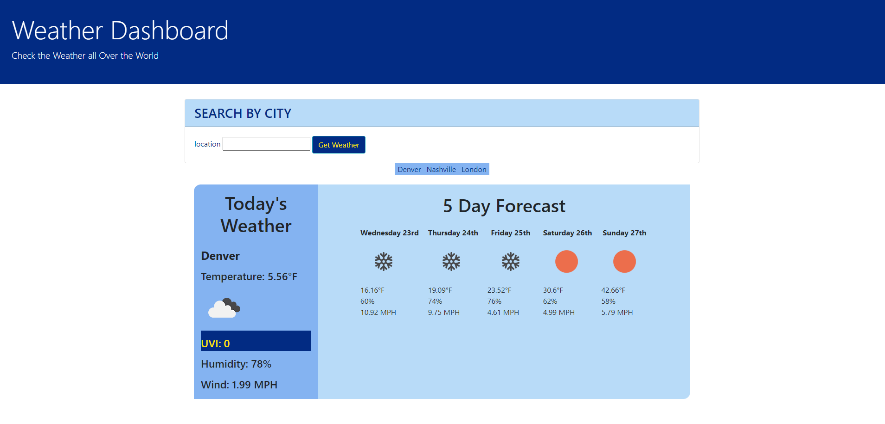

Weather Dashboard

- Tasked with building a weather dashboard.
- I amto use the OpenWeather One Call API to retrieve weather data for cities.
- When a form is submited with the name of a city, the user is presented with current and future conditions for that city and that city is added to the search history.
- The search results must include the city name, the date, an icon representation of weather conditions, the temperature, the humidity, the wind speed, and the UV index.
- The UV index also has a color that indicates whether the conditions are favorable, moderate, or severe. i went with yellow for favorable, black for moderate, and red for severe.
- The search results will also include a 5-day forecast that displays the date, an icon representation of weather conditions, the temperature, the wind speed, and the humidity. 
- When the user clicks the search history, they are again presented with current and future conditions for that city.

link https://par92.github.io/HW-6/

screenshot 